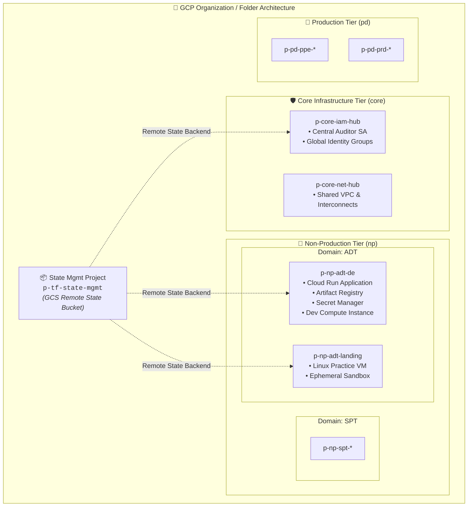
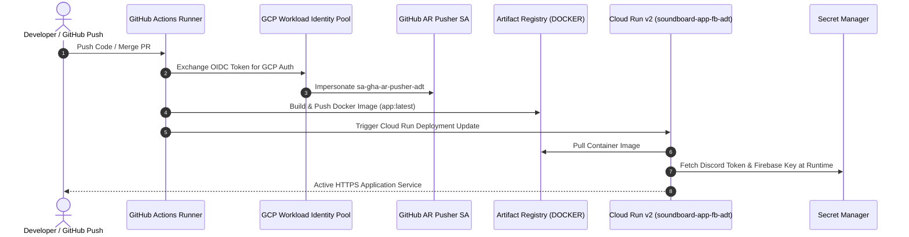
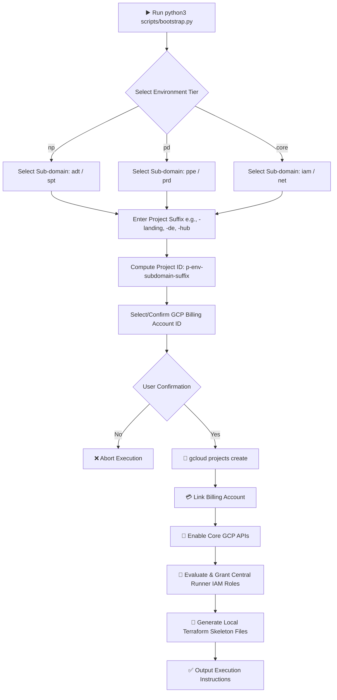

# 🚀 GCP Multi-Environment Infrastructure & Automation


Welcome to the enterprise **GCP Infrastructure as Code (IaC)** repository. This workspace hosts modular Terraform codebases, state management abstractions, CI/CD Workload Identity integration, and an interactive CLI bootstrapper for scalable multi-environment Google Cloud Platform deployments.

---

## 📐 Architecture Overview & Diagrams

### 1. Multi-Tier Environment Hierarchy

The repository enforces a structured naming convention and organizational tiering:
- **`p-core-*`**: Central management, global IAM, security auditing, and shared networking.
- **`p-np-*`**: Non-Production development, testing, staging, and landing sandboxes.
- **`p-pd-*`**: Production production-grade workloads and isolated data stores.



---

### 2. CI/CD & Workload Identity Federation Architecture

Secure keyless deployment mechanism using GitHub Actions and GCP Workload Identity Pools to build, push, and run containerized workloads on Google Cloud Run.



---

### 3. Interactive CLI Bootstrap Pipeline (`scripts/bootstrap.py`)

An interactive Python terminal interface powered by `rich` and `inquirer` to automate project provisioning, API enablement, IAM binding, and backend generation.



---

## 🗂️ Repository Directory Tree Map

```
.
├── scripts/
│   └── bootstrap.py              # Interactive GCP project onboarding & Terraform generator CLI
└── terraform_gcp/
    ├── core/
    │   └── iam/
    │       └── p-core-iam-hub/   # Global IAM policy, security auditor, and Google Groups
    │           ├── api.tf
    │           ├── np-adt-groups.tf
    │           ├── np_adt_sa_create.tf
    │           ├── np_adt_sa_roles.tf
    │           ├── provider.tf
    │           └── variables.tf
    └── np/
        └── adt/
            ├── p-np-adt-de/      # Non-prod ADT workload (Cloud Run, Artifact Registry, Secrets, VM)
            │   ├── api.tf
            │   ├── artifact_registry.tf
            │   ├── cloud_run.tf
            │   ├── provider.tf
            │   ├── sa_create.tf
            │   ├── sa_roles.tf
            │   ├── secrets.tf
            │   ├── variables.tf
            │   └── vm_instance.tf
            └── p-np-adt-landing/ # Ephemeral Linux sandbox environment
                ├── api.tf
                ├── main.tf
                ├── outputs.tf
                ├── provider.tf
                ├── terraform.tfvars
                └── variables.tf
```

---

## 🧰 Infrastructure Modules Summary

| Module Path | Environment | Primary Resources | Key Capabilities |
| :--- | :---: | :--- | :--- |
| `terraform_gcp/core/iam/p-core-iam-hub` | **Core** | Security Auditor SA, IAM Bindings | Organization-wide viewing, IAM auditing, security compliance. |
| `terraform_gcp/np/adt/p-np-adt-de` | **Non-Prod** | Cloud Run v2, Artifact Registry, Secret Manager, Compute VM | Container application lifecycle, Keyless WIF deployment, secret injection. |
| `terraform_gcp/np/adt/p-np-adt-landing` | **Non-Prod** | Compute Engine VM (Ubuntu 24.04 LTS) | Development landing zone and compute sandbox testing. |

---

## ⚡ Quick Start & Onboarding Guide

### Prerequisites
- **Google Cloud SDK (`gcloud`)** installed and authenticated (`gcloud auth login`).
- **Terraform** `>= 1.5.0` installed.
- **Python 3.9+** with required CLI packages (`rich`, `inquirer`).

### 1. Provision New GCP Infrastructure Project

Run the interactive bootstrapper tool:

```bash
python3 scripts/bootstrap.py
```

Follow the prompt sequence:
1. Select Target Tier (`np`, `pd`, `core`).
2. Select Sub-domain (`adt`, `spt`, `iam`, `net`).
3. Enter Project Suffix (e.g., `de`, `landing`, `hub`).
4. Confirm Billing Account linking.

The script automatically:
- Creates the GCP project (`p-[env]-[subdomain]-[suffix]`).
- Links the designated billing account.
- Enables essential GCP APIs (`cloudresourcemanager`, `iam`, `compute`, `secretmanager`, `artifactregistry`, `run`).
- Grants IAM roles to the central runner service account (`gha-central-runner@p-tf-state-mgmt.iam.gserviceaccount.com`).
- Creates local Terraform boilerplate (`provider.tf`, `variables.tf`, `api.tf`, `main.tf`).

---

### 2. Standard Terraform Workflow

To initialize and deploy an infrastructure module:

```bash
# Navigate to target environment directory
cd terraform_gcp/np/adt/p-np-adt-de

# Initialize GCS remote backend
terraform init

# Generate & review deployment plan
terraform plan

# Apply infrastructure changes
terraform apply
```

---

## 🔒 Security & Compliance Architecture

- **Least Privilege Access**: Each workload runs under a dedicated, tightly scoped Service Account (`sa-soundboard-runner-adt`).
- **Keyless Authentication**: Eliminates static service account keys by utilizing Workload Identity Federation (`roles/iam.workloadIdentityUser`) mapped to GitHub repository attributes.
- **Secret Access Control**: Sensitive tokens (e.g. Discord Bot Tokens, Firebase Web Keys) are stored in Secret Manager and accessed exclusively at runtime via Secret Accessor IAM bindings.
- **Central State Locking**: Terraform state is stored securely in remote GCS buckets (`p-tf-state-mgmt-bucket`) with path-isolated state locks.

---

## 📝 License

This repository is licensed under the [MIT License](LICENSE).
